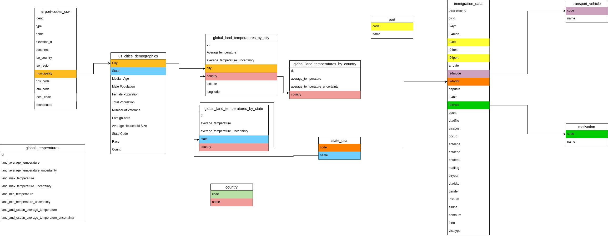

# Final design of the Udacity data engineering course
   
The objective of this project is to model an ETL so that to create three fact tables using the dimension tables, this algorithm must run in the EMR. For that it is necessary to place the files in S3, the table below shows the name of the file and the path that should be used in S3.

| file name | description | S3 path |
| ------ | ------ | ------ |
| airport-codes_csv.csv | Airport data. | s3://final-project-udacity/original/airport_codes/|
| country_code_and_name.csv | Country code and name | s3://final-project-udacity/original/country_code_and_name/ |
| immigration file Parquet (has no name) | Immigration data. | s3://final-project-udacity/original/immigration_data/ |
| motivation.csv | Motivations for immigration. | s3://final-project-udacity/original/motivation/ |
| port.csv | Ports data. |s3://final-project-udacity/original/port/ |
| state_usa.csv | Code and name of the states of the United States of America. | s3://final-project-udacity/original/state_usa/ |
| GlobalLandTemperaturesByCity.csv | Temperature data for cities in different countries around the world. |s3://final-project-udacity/original/temperatures_data/global_land_temperatures_by_city/ |
| GlobalLandTemperaturesByCountry.csv | Temperature data from countries around the world. |  s3://final-project-udacity/original/temperatures_data/global_land_temperatures_by_country/ |
| GlobalLandTemperaturesByMajorCity.csv | Temperature data of the capitals of the world. | s3://final-project-udacity/original/temperatures_data/global_land_temperatures_by_major_city/ |
| GlobalLandTemperaturesByState.csv | Temperature data for states in countries around the world. | s3://final-project-udacity/original/temperatures_data/global_land_temperatures_by_state/ |
| GlobalTemperatures.csv | Global temperature data. | s3://final-project-udacity/original/temperatures_data/global_temperatures/ |
| transport_vehicle.csv | Types of transport used for immigration. | s3://final-project-udacity/original/transport_vehicle/ |
| us_cities_demographics.csv | Demographic data. | s3://final-project-udacity/original/us_cities_demographics/ |

### Setting up the environment.

1. Place the files in the respective folders in the S3 bucket. [Download the data](https://drive.google.com/drive/folders/1-vF_FEicXZqt3WgXlz7oRTCtTyHO9Jej?usp=sharing)
2. In the configuration file 'dl.cfg' use your credentials to access AWS services.

### Below is the data architecture used to arrive at the results.
